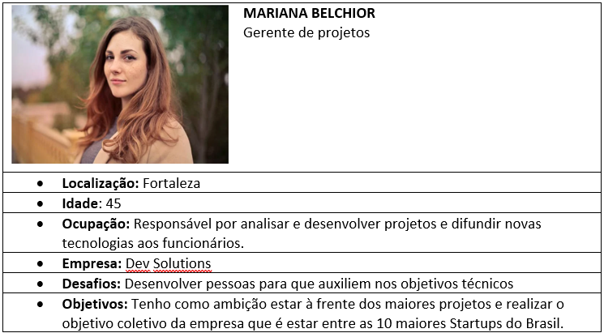
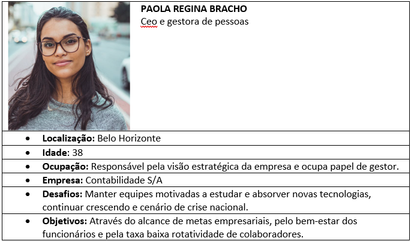

# Especificações do Projeto

Pré-requisitos: <a href="1-Documentação de Contexto.md"> Documentação de Contexto</a>

A definição exata do problema e os pontos mais relevantes a serem tratados neste projeto foram consolidadas com a participação dos usuários em um trabalho de imersão feita pelos membros da equipe a partir da observação dos usuários em seu local natural e por meio de entrevistas. Os detalhes levantados nesse processo foram  consolidados na forma de personas e histórias de usuários.

## Personas

As personas levantadas durante o processo de entendimento do problema são apresentadas na Figuras que se seguem.

### **`Éder Aleixo`**

|   | **Éder Aleixo**   42 anos   |
|:---------------------------------------:|:-------------------------------:|
|**Ocupação** | CEO de Empresa de TI 
|**Principais Aplicativos Utilizados** |MySQL, Visual Studio
|**Obejtivos** |Melhorias dos processos de gerenciamento de equipes, tornar mais versátil o modelo de trabalho dos colaboradores utilizando das modalidades home office e híbrido.
|**Desafios** |Desafios: Assegurar que os colaboradores cumpram os termos de contrato de trabalho.|

2: MARIANA BELCHIOR:

3: ROGÉRIA SKYLAB:

4: PAOLA REGINA BRACHO:

## Histórias de Usuários

Com base na análise das personas forma identificadas as seguintes histórias de usuários:

|EU COMO... `PERSONA`| QUERO/PRECISO ... `FUNCIONALIDADE` |PARA ... `MOTIVO/VALOR`                 |
|--------------------|------------------------------------|----------------------------------------|
|Mariana Belchior/ Paola Bracho      | Emitir relatório do registro de ponto | Conseguir detalhar os horários de inicio e fim de jornada de trabalho dos colaboradores.|
|Paola Bracho / Eder       | Monitorar equipe em tempo real | Visualizar em tempo real o posicionamento do usuário conforme localização registrada.  |
|Mariana Belchior       | Calcular horários automaticamente| Obter com facilidade o somatório de horas decorrentes por determinado período de tempo. (semanal, mensal)|
|Eder     | Receber relatório por e-mail | Possuir  relatório do registro de ponto em PDF por e-mail.|
|Carlos Cesar       | Visualizar  banco de horas. | Consultar banco de horas com o intuito de visualizar crédito de horas. (horas extras e negativas). |
|Carlos Cesar/ Mariana Belchior       | Flexibilizar horários. | Registrar horários para cada usuário de forma diferenciada, com intuito de flexibilizar turnos.  |
|Rogéria Skylab      | Visualizar ícones de forma acessível.| Tornar acessível a visualização dos ícones, para facilitar a usabilidade do usuário.  |
|Rogéria Skylab      | Receber confirmação de ponto. | Enviar notificação, ou aviso gráfico que o ponto foi registrado com sucesso. |
|Paola Bracho/ Eder       |Ser avisado por não conformidades no registro. | Receber  avisos de  atrasos ou excedente de horário recorrentes, para tomadas de decisão.  |

## Requisitos

O escopo funcional do projeto é definido por meio dos requisitos funcionais que descrevem as possibilidades interação dos usuários, bem como os requisitos não funcionais que descrevem os aspectos que o sistema deverá apresentar de maneira geral. 

### Requisitos Funcionais

A tabela a seguir apresenta os requisitos do projeto, identificando a prioridade em que os mesmos devem ser entregues.

|ID    | Descrição do Requisito  | Prioridade |
|------|-----------------------------------------|----|
|RF-01 | Deve possuir tela "Home" com ícones acessíveis e fornecer acesso a página de registro de ponto. | ALTA |
|RF-02 | Deve possibilitar o cadastro do colaborador em seu registro de banco de horas, permitindo a visualização de futuro histórico de horas. | ALTA|
|RF-03 | Deve fornecer uma página com relatório de horas e opção de envio. | MÉDIA |
|RF-04 | Deve possuir opção de geolocalização para monitoramento  do usuário. | BAIXA |
|RF-05 | A aplicação deve fornecer o cálculo das horas trabalhadas por período de tempo específico, ex: semanal, mensal. | MÉDIA |
|RF-06 | Deve possuir opção diferenciada de  turnos para registro de horários, conforme a solicitação de cada empresa. | ALTA |
|RF-07 | A aplicação deve informar ao usuário a confirmação de que o ponto foi registrado, de forma instantânea. | ALTA |
|RF-08 | Havendo recorrência de não conformidade no registro de pontos, a aplicação deve fornecer aviso ao usuário. Tomando como não conformidades: Atrasos, faltas, excedência de horários de forma consecutiva. | BAIXA |

### Requisitos não Funcionais

|ID     | Descrição do Requisito  |Prioridade |
|-------|-------------------------|----|
|RNF-001| O sistema deve ser responsivo para rodar em um dispositivos móvel | MÉDIA | 
|RNF-002| Deve processar requisições do usuário em no máximo 3s |  BAIXA | 
|RNF-003| Os relatorios devem ser emitidos em PDF |  BAIXA | 
|RNF-004| O sitema deve buscar localização do usuario atraves da Google Geocoding API. |Media|

Com base nas Histórias de Usuário, enumere os requisitos da sua solução. Classifique esses requisitos em dois grupos:

- [Requisitos Funcionais
 (RF)](https://pt.wikipedia.org/wiki/Requisito_funcional):
 correspondem a uma funcionalidade que deve estar presente na
  plataforma (ex: cadastro de usuário).
- [Requisitos Não Funcionais
  (RNF)](https://pt.wikipedia.org/wiki/Requisito_n%C3%A3o_funcional):
  correspondem a uma característica técnica, seja de usabilidade,
  desempenho, confiabilidade, segurança ou outro (ex: suporte a
  dispositivos iOS e Android).
Lembre-se que cada requisito deve corresponder à uma e somente uma
característica alvo da sua solução. Além disso, certifique-se de que
todos os aspectos capturados nas Histórias de Usuário foram cobertos.

## Restrições

O projeto está restrito pelos itens apresentados na tabela a seguir.

|ID| Restrição                                             |
|--|-------------------------------------------------------|
|01| O projeto deverá ser entregue até o final do semestre |
|02| Não pode ser desenvolvido um módulo de backend        |

Enumere as restrições à sua solução. Lembre-se de que as restrições geralmente limitam a solução candidata.

> **Links Úteis**:
> - [O que são Requisitos Funcionais e Requisitos Não Funcionais?](https://codificar.com.br/requisitos-funcionais-nao-funcionais/)
> - [O que são requisitos funcionais e requisitos não funcionais?](https://analisederequisitos.com.br/requisitos-funcionais-e-requisitos-nao-funcionais-o-que-sao/)

## Diagrama de Casos de Uso

O diagrama de casos de uso é o próximo passo após a elicitação de requisitos, que utiliza um modelo gráfico e uma tabela com as descrições sucintas dos casos de uso e dos atores. Ele contempla a fronteira do sistema e o detalhamento dos requisitos funcionais com a indicação dos atores, casos de uso e seus relacionamentos. 

As referências abaixo irão auxiliá-lo na geração do artefato “Diagrama de Casos de Uso”.

> **Links Úteis**:
> - [Criando Casos de Uso](https://www.ibm.com/docs/pt-br/elm/6.0?topic=requirements-creating-use-cases)
> - [Como Criar Diagrama de Caso de Uso: Tutorial Passo a Passo](https://gitmind.com/pt/fazer-diagrama-de-caso-uso.html/)
> - [Lucidchart](https://www.lucidchart.com/)
> - [Astah](https://astah.net/)
> - [Diagrams](https://app.diagrams.net/)
